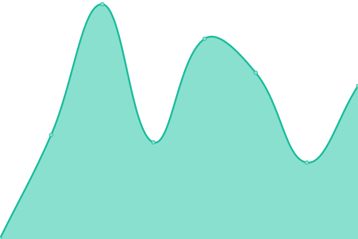
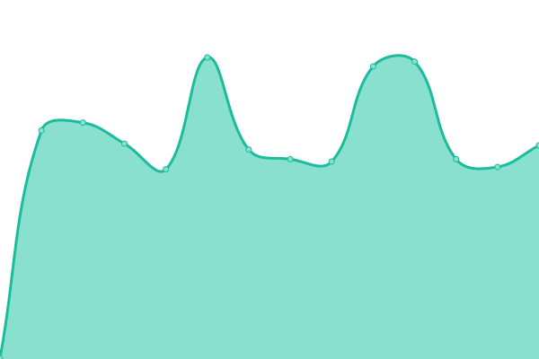

# [📈 Live Status](https://gigapipehq.github.io/healthcheck): <!--live status--> **🟩 All systems operational**

This repository contains the open-source uptime monitor and status page for [Gigapipe](https://gigapipe.com), powered by [Upptime](https://github.com/upptime/upptime).

With [Upptime](https://upptime.js.org), you can get your own unlimited and free uptime monitor and status page, powered entirely by a GitHub repository. We use [Issues](https://github.com/gigapipehq/healthcheck/issues) as incident reports, [Actions](https://github.com/gigapipehq/healthcheck/actions) as uptime monitors, and [Pages](https://gigapipehq.github.io/healthcheck) for the status page.

<!--start: status pages-->
<!-- This summary is generated by Upptime (https://github.com/upptime/upptime) -->
<!-- Do not edit this manually, your changes will be overwritten -->
<!-- prettier-ignore -->
| URL | Status | History | Response Time | Uptime |
| --- | ------ | ------- | ------------- | ------ |
|  US-3C-API | 🟩 Up | [us-3-c-api.yml](https://github.com/gigapipehq/healthcheck/commits/HEAD/history/us-3-c-api.yml) | 

 295ms
     
 | 

<a href="https://gigapipehq.github.io/healthcheck/history/us-3-c-api">100.00%</a>
    

|  US-3C-AUTH | 🟩 Up | [us-3-c-auth.yml](https://github.com/gigapipehq/healthcheck/commits/HEAD/history/us-3-c-auth.yml) | 

 268ms
     
 | 

<a href="https://gigapipehq.github.io/healthcheck/history/us-3-c-auth">100.00%</a>
    

|  US-3C-QRYN | 🟩 Up | [us-3-c-qryn.yml](https://github.com/gigapipehq/healthcheck/commits/HEAD/history/us-3-c-qryn.yml) | 

 215ms
     
 | 

<a href="https://gigapipehq.github.io/healthcheck/history/us-3-c-qryn">100.00%</a>
    

|  US-3C-APP | 🟩 Up | [us-3-c-app.yml](https://github.com/gigapipehq/healthcheck/commits/HEAD/history/us-3-c-app.yml) | 

 259ms
     
 | 

<a href="https://gigapipehq.github.io/healthcheck/history/us-3-c-app">100.00%</a>
    

|  EU-SM-API | 🟩 Up | [eu-sm-api.yml](https://github.com/gigapipehq/healthcheck/commits/HEAD/history/eu-sm-api.yml) | 

 588ms
     
 | 

<a href="https://gigapipehq.github.io/healthcheck/history/eu-sm-api">100.00%</a>
    

|  EU-SM-AUTH | 🟩 Up | [eu-sm-auth.yml](https://github.com/gigapipehq/healthcheck/commits/HEAD/history/eu-sm-auth.yml) | 

 573ms
     
 | 

<a href="https://gigapipehq.github.io/healthcheck/history/eu-sm-auth">100.00%</a>
    

|  EU-SM-QRYN | 🟩 Up | [eu-sm-qryn.yml](https://github.com/gigapipehq/healthcheck/commits/HEAD/history/eu-sm-qryn.yml) | 

 662ms
     
 | 

<a href="https://gigapipehq.github.io/healthcheck/history/eu-sm-qryn">100.00%</a>
    

|  EU-SM-APP | 🟩 Up | [eu-sm-app.yml](https://github.com/gigapipehq/healthcheck/commits/HEAD/history/eu-sm-app.yml) | 

 545ms
     
 | 

<a href="https://gigapipehq.github.io/healthcheck/history/eu-sm-app">100.00%</a>
    

<!--end: status pages-->

[**Visit our status website →**](https://gigapipehq.github.io/healthcheck)

## 📄 License

- Powered by: [Upptime](https://github.com/upptime/upptime)
- Code: [MIT](./LICENSE) © [Anand Chowdhary](https://anandchowdhary.com), supported by [Pabio](https://pabio.com)
- Data in the `./history` directory: [Open Database License](https://opendatacommons.org/licenses/odbl/1-0/)
